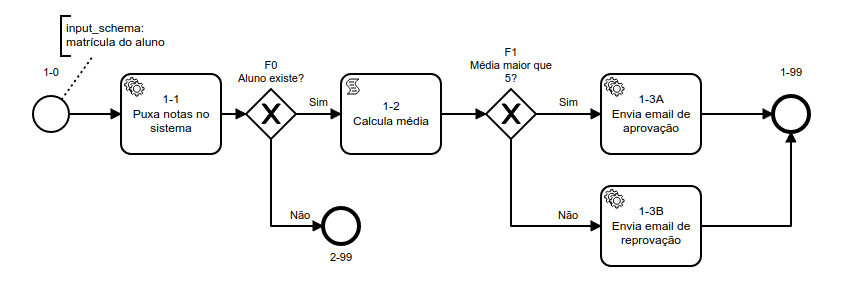

# 🏗️ Intro to blueprint testing

A simple exemple of use of [Jest](https://jestjs.io/) testing framework with [flow-build workflow engine](https://github.com/flow-build/engine)

Check the [presentation](./docs/Introdução%20a%20testes%20com%20workflow.pdf) about testing

## Sample workflow



The blueprint is in **./blueprint/sistema_alunos.js**

## Dependencies

```sh
node -v
v12.18.3

npm -v
6.14.6
```

## Run the tests

```sh
npm test
npm run test-watch
```

Start the mock API server

```sh
node ./src/server/index.js
```
